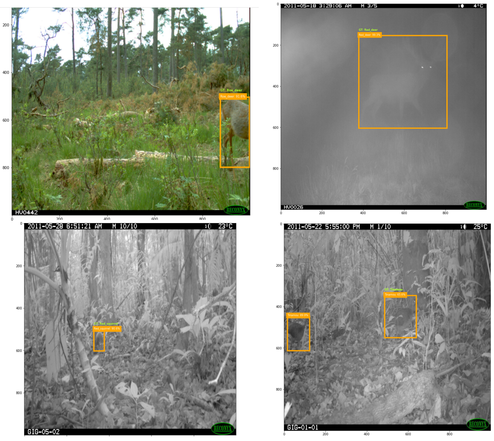

# Animal_detection
* Here I worked with camera trap data from the Reconyx Camera Trap data set.
There are 20 animal species of different sizes, so it was necessary to choose a model that will cope with the challenge of detecting and determining the class of even small objects.
'Faster RCNN` model with the backbone `resnet50_fpn` was chosen for the fine-tuning.
According to the "Weakly Supervised Faster-RCNN+FPN to classify animals in camera trap images" paper (https://arxiv.org/pdf/2208.14060.pdf) this model is more suitable for small objects on camera trap data.
* I chose the `torchvision.models.detection` framework.

* This approach shows that it is possible to use a model to automatically detect and classify animals from camera trap images, which can make it easier for field zoologists and ecologists to analyze the numbers and species of local fauna. Even with the small size of several objects and challenging night and foggy shooting conditions, the model is able to make accurate predictions of localization and class for some objects of different size.
However, it may be necessary to use additional methods to balance the sample, since the range of AP was between 32% to 100%.
The model has undergone 102 epochs of training and the mAP reached 64.9% on 24 random images. Nevertheless, it was not enough, since the mAP on the validation set was lower and the bounding box on the random image from the Internet was not accurate. According to "Weakly Supervised Faster-RCNN+FPN to classify animals in camera trap images" paper (https://arxiv.org/pdf/2208.14060.pdf) 200 epochs is necessary to reach the best performance. Therefore, fine-tuning for 200 epochs with photos specific to the location is necessary for optimal performance in field tests. The model may be implemented on a server for automatic detection to occur.

* Source: `Reconyx Camera Trap data set`. X. Yu, J. Wang, R. Kays, P. A. Jansen, T. Wang, and T. Huang,
“Automated identification of animal species in camera trap images,” EURASIP Journal on Image and Video Processing, vol. 2013, no. 1, p. 52, 2013. https://jivp-eurasipjournals.springeropen.com/articles/10.1186/1687-5281-2013-52

* Data were downloaded from https://borealisdata.ca/dataset.xhtml?persistentId=doi:10.5683/SP/TPB5ID

